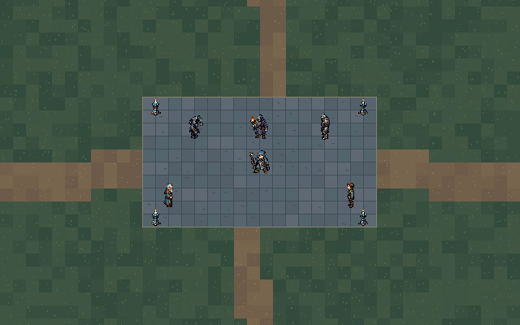

# Ruined Academy

A solo-first, dark-fantasy pixel-art Action RPG built in **Godot 4.7** for desktop (macOS / Linux / Windows).



## Overview

You play as a former student wizard returning to a ruined magical academy. Master elemental and forbidden magic, customize spells, allocate points into a branching passive tree, battle corrupted monstrosities, and restore the academy's forgotten workshops and ward beacons.

- **Perspective**: Elevated top-down view with clear pixel readability and silhouettes.
- **Controls**: Fluid 8-directional WASD movement and responsive mouse-aimed casting.
- **Combat**: Fast magic projectiles with raycast sweep collision, point-blank overlap handling, enemy hit flashes, and dynamic overhead health bars.
- **Visuals**: Cohesive dark-fantasy palette (desaturated stone, weathered bronze, ink-blue shadows, and vibrant elemental magic) generated with Pixel Lab.

---

## Project Structure

```
├── game/                    # Godot 4.7 project
│   ├── project.godot        # Engine configuration (640x400 native viewport, GL Compatibility)
│   ├── main.tscn            # Primary playable combat scene
│   ├── player.gd            # Wizard movement, 8-way facing, and projectile firing
│   ├── projectile.gd        # Swept raycast magic missile with collision & despawning
│   ├── enemy.gd / enemy.tscn# Enemy entity with damage, facing, hurt/death animations, health bar
│   ├── animation_library.gd # Builds directional animations from asset folders
│   ├── map.gd               # Map layout (stone courtyard, paths, grass)
│   └── tests/               # Headless automated test suite (combat, movement, preview)
├── art_library/             # 300+ generated visual assets from Pixel Lab
│   ├── assets/              # Sprites, directional animation sheets, props, tiles, UI, icons
│   ├── queue.json           # Declarative generation queue
│   └── status.json          # Production pipeline tracking
├── tools/                   # Generation automation scripts
│   ├── build_asset_queue.py # Translates ASSET_MANIFEST into API tasks
│   └── pixellab_batch.py    # Multi-worker generation processor
└── ASSET_MANIFEST.md        # Comprehensive art specification and production roadmap
```

---

## Getting Started

### Prerequisites

- [Godot Engine 4.7](https://godotengine.org/) (Standard or .NET edition)

### Running the Game

1. Open Godot and click **Import**.
2. Select the `game/project.godot` file in this repository.
3. Open `main.tscn` and press **F6** (or **F5** to run the project).

Or, from a terminal in the repository root:

```bash
./play.sh
```

The script imports assets before launching. Godot's import cache (`game/.godot/`) isn't committed, so running a fresh clone with `godot --path game` directly shows no sprites. Set `GODOT=/path/to/godot` if Godot isn't on your `PATH`.

### Controls

| Action | Input |
|---|---|
| Move Up / Left / Down / Right | **W** / **A** / **S** / **D** |
| Aim | **Mouse Cursor** |
| Cast Magic Missile | **Left Mouse Button** |
| Dodge | **Space** |
| Toggle Fullscreen | **F11** or **Alt + Enter** |

---

## Running Automated Tests

The project includes headless automated integration tests:

```bash
# Wizard idle, walk, and cast animations
godot --headless --path game -s res://tests/animation_test.gd

# Movement & boundary verification
godot --headless --path game -s res://tests/movement_test.gd

# Combat, swept raycasts, damage, and projectile cleanup
godot --headless --path game -s res://tests/combat_test.gd

# Viewport preview capture
godot --headless --path game -s res://tests/render_preview.gd
```

---

## License

This project is licensed under the MIT License.
