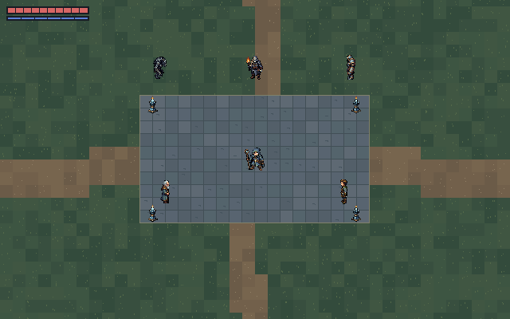
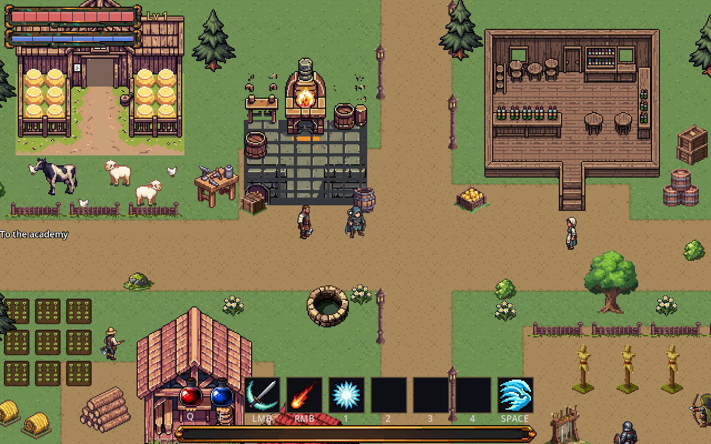
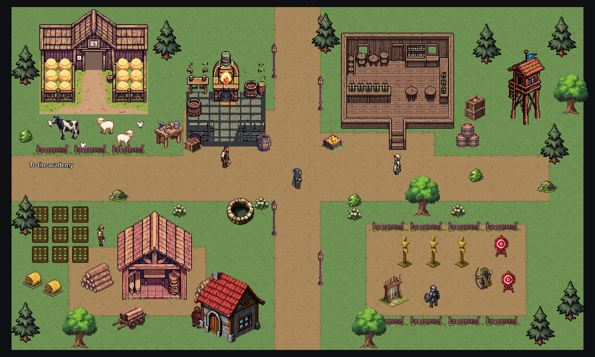

# Ruined Academy

A solo-first, dark-fantasy pixel-art Action RPG built in **Godot 4.7** for desktop (macOS / Linux / Windows).



## Overview

You play as a former student wizard returning to a ruined magical academy. Master elemental and forbidden magic, customize spells, allocate points into a branching passive tree, battle corrupted monstrosities, and restore the academy's forgotten workshops and ward beacons.

- **Perspective**: Elevated top-down view with clear pixel readability and silhouettes.
- **Controls**: Fluid 8-directional WASD movement, mouse-aimed melee and casting, number-key skills, and a dodge dash.
- **Combat**: A Wind Slash sword swing and a flying Wind Wave, a magic bolt and Frost Nova, crits, mana, life and mana flasks, and enemies that chase, swing, and cast, with attack windups you can step out of.
- **Loot**: Path of Exile-style items with random affixes, rarities, and uniques; enemies drop loot with labels you click to pick up.
- **Inventory**: A shaped-item grid backpack, ten equipment slots, and tooltips that compare stats; gear is saved between sessions.
- **Progression**: Kills give experience; each level grows life, mana, and spell damage and grants a point for a small passive tree.
- **World**: The ruined academy's courtyard, and a village down the east road with its forge, tavern, barn, sawmill, garden, training yard, and villagers.
- **Visuals**: Cohesive dark-fantasy palette (desaturated stone, weathered bronze, ink-blue shadows, and vibrant elemental magic) generated with Pixel Lab.

See [`game/README.md`](game/README.md) for how the prototype plays.

### The village

Follow the road east out of the courtyard to reach the village. Buildings, trees, and props block the way, villagers turn to watch you pass, and the road west leads back to the academy.





---

## Project Structure

```
├── game/                    # Godot 4.7 project
│   ├── project.godot        # Engine configuration (640x400 native viewport, GL Compatibility)
│   ├── main.tscn            # Primary playable combat scene (the academy courtyard)
│   ├── village.tscn         # The village map, east of the courtyard
│   ├── wizard.tscn / hud.tscn # The wizard and the HUD, shared by both maps
│   ├── scenery.gd           # A village art piece: y-sorted, scaled, optional blocking footprint
│   ├── village_ground.gd    # Village grass and dirt roads from a corner tileset
│   ├── travel.gd            # Road ends that move the wizard between maps
│   ├── player.gd            # Wizard: movement, casting, dodge, flasks, life and mana
│   ├── projectile.gd        # Swept raycast magic missile with collision & despawning
│   ├── frost_nova.gd        # Frost Nova: cold burst around the wizard that chills
│   ├── wind_wave.gd         # Wind Wave: a crescent of wind that flies through enemies
│   ├── skill_bar.gd         # Skill bar (LMB bolt, RMB nova)
│   ├── flask_bar.gd         # Life and mana flask vials
│   ├── pause_menu.gd        # Esc pause menu: Resume / Quit
│   ├── enemy.gd / enemy.tscn# Enemy AI (chase, melee/ranged attacks), damage, animations, health bar
│   ├── enemy_projectile.gd  # The Scholar's hostile bolt
│   ├── hud.gd               # Life and mana bars, messages, fallen prompt
│   ├── stats.gd             # Character stats from level and gear; armour and resistance maths
│   ├── character.gd         # Autoload: level, experience, and allocated passives, saved
│   ├── passives.gd          # Passive tree nodes, links, and stats
│   ├── passive_tree_panel.gd# Passive tree screen (P)
│   ├── experience_bar.gd    # Experience bar under the skill bar
│   ├── level_up_effect.gd   # Gold and cyan sparkle burst on a level-up
│   ├── effect.gd            # Sprite effects: one-shot impacts and looping clips
│   ├── inventory.gd         # Autoload: equipped gear, 10x5 backpack grid, save file
│   ├── items/               # Item bases, affixes, uniques, and the random item generator
│   ├── character_panel.gd   # Character sheet (C)
│   ├── inventory_panel.gd   # Inventory screen (I): equipment slots and backpack grid
│   ├── item_tooltip.gd      # Item tooltip with stat comparison
│   ├── loot.gd              # Enemy drop tables and spawning items on the ground
│   ├── ground_item.gd       # An item on the ground: icon, label, beam, pickup
│   ├── animation_library.gd # Builds directional animations from asset folders
│   ├── npc.gd / npc.tscn    # Idle NPC that turns to watch the wizard
│   ├── prop.gd              # Looping animated prop (candles)
│   ├── map.gd               # Map layout (stone courtyard, paths, grass)
│   ├── display.gd           # Autoload: fullscreen toggle
│   ├── debug_tools.gd       # Debug keys F3-F5
│   ├── world.gd             # Map bounds and area level
│   └── tests/               # Headless test suites (see below) and the preview renderer
├── art_library/             # 300+ generated visual assets from Pixel Lab
│   ├── assets/              # Sprites, directional animation sheets, props, tiles, UI, icons
│   ├── queue.json           # Declarative generation queue
│   ├── queue-regen.json     # Second pass: effects, icons, wizard clips
│   └── status.json          # Production pipeline tracking
├── tools/                   # Asset generation and import scripts
│   ├── build_asset_queue.py # Translates ASSET_MANIFEST into API tasks
│   ├── build_regen_queue.py # Second-pass queue for art the first pass got wrong
│   ├── pixellab_batch.py    # Multi-worker generation processor
│   ├── copy_character_frames.py # Copies generated animation clips into the game
│   ├── ground_lock_frames.py    # Pins animation frames to the character's ground line
│   ├── make_breathing_idle.py   # Builds the subtle 2-frame idle from still poses
│   ├── copy_prop_frames.py      # Copies a prop animation, keeping solid parts still
│   ├── copy_effect_frames.py    # Copies reviewed spell and combat effect frames
│   ├── build_hud_queue.py       # Queue for HUD art: flasks, bar frame, skill icons
│   ├── make_hud_art.py          # Builds game/assets/ui from the reviewed HUD art
│   ├── build_village_queue.py   # Queue for the village environment set
│   ├── make_village_art.py      # Builds game/assets/village and the villager NPCs
│   └── make_item_icons.py   # Builds game/assets/icons and game/assets/passives from generated art
├── docs/screenshots/        # README screenshots
├── play.sh                  # Imports assets, then runs the game
└── ASSET_MANIFEST.md        # Comprehensive art specification and production roadmap
```

---

## Getting Started

### Prerequisites

- [Godot Engine 4.7](https://godotengine.org/) (Standard or .NET edition)

### Running the Game

1. Open Godot and click **Import**.
2. Select the `game/project.godot` file in this repository.
3. Open `main.tscn` and press **F6** (or **F5** to run the project).

Or, from a terminal in the repository root:

```bash
./play.sh
```

The script imports assets before launching. Godot's import cache (`game/.godot/`) isn't committed, so running a fresh clone with `godot --path game` directly shows no sprites. Set `GODOT=/path/to/godot` if Godot isn't on your `PATH`.

### Controls

| Action | Input |
|---|---|
| Move Up / Left / Down / Right | **W** / **A** / **S** / **D** |
| Aim | **Mouse Cursor** |
| Wind Slash (sword swing that throws magic wind) | **Left Mouse Button** |
| Cast Magic Missile | **Right Mouse Button** |
| Cast Frost Nova (short-range burst around you) | **1** |
| Wind Wave (crescent of wind that flies through enemies) | **2** (3 and 4 are free skill slots) |
| Dodge | **Space** |
| Drink Life / Mana Flask | **Q** / **E** |
| Pause menu (Resume / Quit) | **Esc** |
| Restart after falling | **R** |
| Inventory (click to move, Shift+click to equip/unequip) | **I** (Esc closes) |
| Pick up loot (walks over if far) | **Left-click** its label |
| Show every item label | hold **Alt** |
| Character sheet (gear and stats) | **C** |
| Passive tree (click to allocate, right-click to refund) | **P** |
| Debug: roll and equip a random item / clear gear / respawn enemies / gain a level | **F3** / **F4** / **F5** / **F6** |
| Toggle Fullscreen | **F11** or **Alt + Enter** |

---

## Running Automated Tests

The project includes headless automated integration tests:

```bash
# Passive tree: allocation, refunds, stats, and the tree screen
godot --headless --path game -s res://tests/passives_test.gd

# Experience, levels, and level-up growth
godot --headless --path game -s res://tests/character_test.gd

# Flasks and the pause menu
godot --headless --path game -s res://tests/flasks_pause_test.gd

# Frost Nova: area hits, chill, costs, gear scaling, skill bar
godot --headless --path game -s res://tests/skills_test.gd

# Loot: drops, labels, pickup, dropping items
godot --headless --path game -s res://tests/loot_test.gd

# Inventory screen: cursor, swaps, equipping, tooltips
godot --headless --path game -s res://tests/inventory_ui_test.gd

# Items, affixes, stats, inventory, and saving
godot --headless --path game -s res://tests/items_test.gd

# Enemy AI, wizard health, death, and restart prompt
godot --headless --path game -s res://tests/ai_test.gd

# Wizard idle, walk, and cast animations
godot --headless --path game -s res://tests/animation_test.gd

# Movement & boundary verification
godot --headless --path game -s res://tests/movement_test.gd

# Combat, swept raycasts, damage, and projectile cleanup
godot --headless --path game -s res://tests/combat_test.gd

# Viewport preview capture
godot --headless --path game -s res://tests/render_preview.gd
```

---

## License

This project is licensed under the MIT License.
